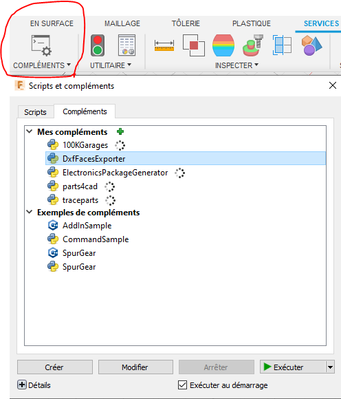
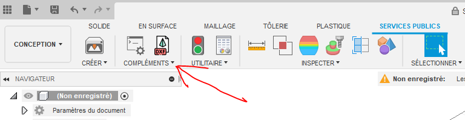

# FusionExportFaceDxf
A faces DXF exporter for Fusion 360

## Installation:

1. Clone the repo and place in the correct Scripts folder for your OS. If downloading the archive be sure to remove "-master" from the folder name.

    * Windows: `C:\Users\<username>\AppData\Roaming\Autodesk\Autodesk Fusion 360\API\AddIns`
    * MacOS: `~/Library/Application Support/Autodesk/Autodesk Fusion 360/API/AddIns`

2. Start Fusion 360
3. Go to Add_Ins/Add_Ins and start DxfFacesExporter

3. Check you have a new Add-In :

## Usage :

1. Open a design with sketches you would like to save out as a DXF.
2. Open the Add_Ins and select the faces you want to export

3. Click "OK" and choose the output folder

